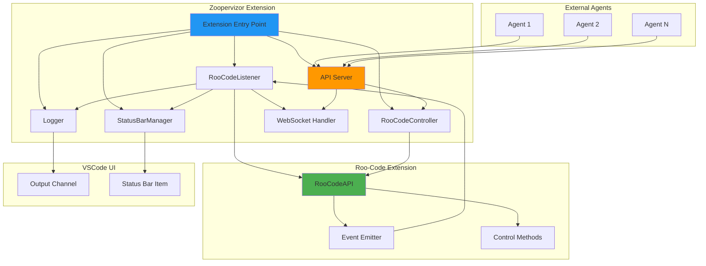

# Zoopervizor - VSCode Extension Architecture Plan

## Project Overview

**Name**: Zoopervizor  
**Purpose**: A VSCode extension that monitors Roo-Code activities and exposes an API bridge for external agent communication  
**MVP Goals**:
1. Listen to and log all Roo-Code task events
2. Provide visual feedback via status bar
3. Expose HTTP/WebSocket API for external agents to monitor and control Roo-Code

## Project Structure

```
zoopervizor/
├── docs/
│   ├── roo-code-events-integration-guide.md
│   ├── architecture-plan.md
│   └── api-documentation.md (to be created)
├── src/
│   ├── extension.ts                 # Main entry point
│   ├── roo-code/
│   │   ├── listener.ts              # RooCodeListener class
│   │   ├── types.ts                 # Type definitions from @roo-code/types
│   │   └── controller.ts            # RooCodeController for API methods
│   ├── logging/
│   │   ├── logger.ts                # Logging system
│   │   └── output-channel.ts        # VSCode OutputChannel wrapper
│   ├── ui/
│   │   └── status-bar.ts            # StatusBarManager
│   ├── api/
│   │   ├── server.ts                # HTTP/WebSocket server
│   │   ├── routes.ts                # API route handlers
│   │   ├── websocket.ts             # WebSocket event streaming
│   │   └── types.ts                 # API request/response types
│   ├── config/
│   │   └── settings.ts              # Configuration management
│   └── utils/
│       ├── error-handler.ts         # Error handling utilities
│       └── validation.ts            # Input validation
├── package.json                      # Extension manifest
├── tsconfig.json                     # TypeScript configuration
├── .vscodeignore                     # Files to exclude from package
├── .gitignore
└── README.md
```

## Architecture Diagram



## Core Components

### 1. Extension Entry Point (`src/extension.ts`)

**Responsibilities**:
- Initialize all components
- Handle extension activation/deactivation
- Manage component lifecycle
- Register commands and configuration listeners

**Key Functions**:
```typescript
export function activate(context: vscode.ExtensionContext): void
export function deactivate(): void
```

### 2. RooCodeListener (`src/roo-code/listener.ts`)

**Responsibilities**:
- Connect to Roo-Code API
- Register event listeners for all Roo-Code events
- Forward events to Logger, StatusBar, and API Server
- Handle connection errors gracefully

**Key Events to Monitor**:
- Task lifecycle: `taskCreated`, `taskStarted`, `taskCompleted`, `taskAborted`
- Execution: `message`, `taskModeSwitched`, `taskUserMessage`
- Analytics: `taskTokenUsageUpdated`, `taskToolFailed`
- Configuration: `modeChanged`, `providerProfileChanged`

### 3. RooCodeController (`src/roo-code/controller.ts`)

**Responsibilities**:
- Wrap Roo-Code API control methods
- Provide clean interface for API server
- Handle method call errors
- Validate inputs before calling Roo-Code API

**Key Methods**:
```typescript
startNewTask(options: TaskOptions): Promise<string>
sendMessage(message: string, images?: string[]): Promise<void>
cancelCurrentTask(): Promise<void>
resumeTask(taskId: string): Promise<void>
getConfiguration(): RooCodeSettings
setConfiguration(values: RooCodeSettings): Promise<void>
```

### 4. Logger (`src/logging/logger.ts`)

**Responsibilities**:
- Centralized logging system
- Write to VSCode Output Channel
- Support different log levels (info, warn, error, debug)
- Format log messages with timestamps
- Optional file logging for debugging

**Features**:
- Structured logging with context
- Event categorization
- Performance metrics tracking

### 5. StatusBarManager (`src/ui/status-bar.ts`)

**Responsibilities**:
- Create and manage status bar item
- Update status based on Roo-Code activity
- Show task progress and token usage
- Provide quick actions via status bar commands

**States**:
- Idle: `$(check) Zoopervizor: Ready`
- Running: `$(sync~spin) Zoopervizor: Task Running`
- Completed: `$(check) Zoopervizor: Task Completed`
- Error: `$(x) Zoopervizor: Error`
- Not Connected: `$(warning) Zoopervizor: Roo-Code Not Found`

### 6. API Server (`src/api/server.ts`)

**Responsibilities**:
- Start HTTP server for REST API
- Start WebSocket server for event streaming
- Handle authentication (optional)
- Manage client connections
- Route requests to appropriate handlers

**Configuration**:
- Port: Configurable via settings (default: 3737)
- Host: localhost only for security
- CORS: Disabled by default (local only)

### 7. WebSocket Handler (`src/api/websocket.ts`)

**Responsibilities**:
- Manage WebSocket connections
- Stream Roo-Code events to connected clients
- Handle client subscriptions (filter events)
- Broadcast events to all connected clients
- Handle connection lifecycle

**Event Format**:
```typescript
{
  type: 'event',
  timestamp: string,
  eventName: RooCodeEventName,
  payload: any,
  taskId?: string
}
```

## API Endpoints

### REST API

#### GET `/health`
Check if Zoopervizor is running and connected to Roo-Code
```json
{
  "status": "ok",
  "rooCodeConnected": true,
  "version": "1.0.0"
}
```

#### GET `/status`
Get current Roo-Code status
```json
{
  "isReady": true,
  "currentTaskStack": ["task-id-1"],
  "activeProfile": "default"
}
```

#### POST `/tasks/start`
Start a new Roo-Code task
```json
{
  "text": "Create a new React component",
  "configuration": {
    "mode": "code"
  }
}
```

#### POST `/tasks/message`
Send a message to current task
```json
{
  "message": "Use TypeScript instead",
  "images": []
}
```

#### POST `/tasks/cancel`
Cancel the current task

#### GET `/configuration`
Get Roo-Code configuration

#### PUT `/configuration`
Update Roo-Code configuration

#### GET `/profiles`
List all API profiles

#### POST `/profiles`
Create a new profile

### WebSocket API

#### Connection: `ws://localhost:3737/events`

**Client → Server Messages**:
```json
{
  "type": "subscribe",
  "events": ["taskStarted", "taskCompleted", "message"]
}
```

**Server → Client Messages**:
```json
{
  "type": "event",
  "timestamp": "2025-10-11T03:00:00.000Z",
  "eventName": "taskStarted",
  "payload": ["task-id-123"]
}
```

## Configuration Schema

```json
{
  "zoopervizor.enabled": {
    "type": "boolean",
    "default": true,
    "description": "Enable Zoopervizor monitoring"
  },
  "zoopervizor.api.enabled": {
    "type": "boolean",
    "default": true,
    "description": "Enable API server for external agents"
  },
  "zoopervizor.api.port": {
    "type": "number",
    "default": 3737,
    "description": "Port for API server"
  },
  "zoopervizor.logging.level": {
    "type": "string",
    "enum": ["debug", "info", "warn", "error"],
    "default": "info",
    "description": "Logging level"
  },
  "zoopervizor.logging.showInOutput": {
    "type": "boolean",
    "default": true,
    "description": "Show logs in Output channel"
  },
  "zoopervizor.statusBar.enabled": {
    "type": "boolean",
    "default": true,
    "description": "Show status bar item"
  }
}
```

## Dependencies

### Production Dependencies
- `express`: HTTP server framework
- `ws`: WebSocket server
- `@types/vscode`: VSCode API types

### Development Dependencies
- `typescript`: TypeScript compiler
- `@types/node`: Node.js types
- `@types/express`: Express types
- `@types/ws`: WebSocket types
- `@vscode/vsce`: Extension packaging tool
- `esbuild`: Fast bundler for production builds

### Optional Dependencies
- `@roo-code/types`: Type definitions (if available as npm package)

## Error Handling Strategy

### 1. Roo-Code Not Installed
- Show warning notification
- Disable event listening
- Keep API server running (return appropriate errors)
- Status bar shows "Not Connected" state

### 2. Roo-Code Not Activated
- Attempt to activate Roo-Code extension
- Retry connection with exponential backoff
- Log activation attempts

### 3. API Server Errors
- Port already in use: Try alternative ports or show error
- Network errors: Log and notify user
- Client errors: Return appropriate HTTP status codes

### 4. Event Handling Errors
- Catch and log all event handler errors
- Don't crash extension on event processing errors
- Continue monitoring other events

## Security Considerations

1. **Local Only**: API server binds to localhost only
2. **No Authentication in MVP**: Add in future versions if needed
3. **Input Validation**: Validate all API inputs
4. **Rate Limiting**: Prevent API abuse (future)
5. **CORS**: Disabled by default (local only)

## Development Workflow

### Setup
```bash
npm install
npm run compile
```

### Development
```bash
npm run watch  # Watch mode for development
```

### Testing
```bash
# Press F5 in VSCode to launch Extension Development Host
```

### Packaging
```bash
npm run package  # Creates .vsix file
```

## Implementation Phases

### Phase 1: Core Infrastructure (MVP Foundation)
- Project setup and configuration
- Extension entry point
- Basic Roo-Code connection
- Simple logging to Output channel

### Phase 2: Event Monitoring (MVP Core)
- Complete event listener implementation
- Status bar integration
- Comprehensive logging

### Phase 3: API Server (MVP Complete)
- HTTP REST API
- WebSocket event streaming
- API documentation

### Phase 4: Polish & Documentation
- Error handling improvements
- Configuration options
- README and API docs
- Testing and validation

## Success Criteria

✅ Extension activates without errors  
✅ Successfully connects to Roo-Code API  
✅ Logs all Roo-Code events to Output channel  
✅ Status bar updates based on Roo-Code activity  
✅ API server starts and accepts connections  
✅ WebSocket streams events to connected clients  
✅ REST API can control Roo-Code (start tasks, send messages)  
✅ Graceful handling when Roo-Code is not installed  
✅ Clear documentation for setup and usage  

## Future Enhancements

- Dashboard webview for visualizing task history
- Event filtering and search
- Export events to file (JSON, CSV)
- Integration with external monitoring services
- Authentication for API server
- Support for multiple Roo-Code instances
- Task analytics and metrics
- Custom event triggers and automation