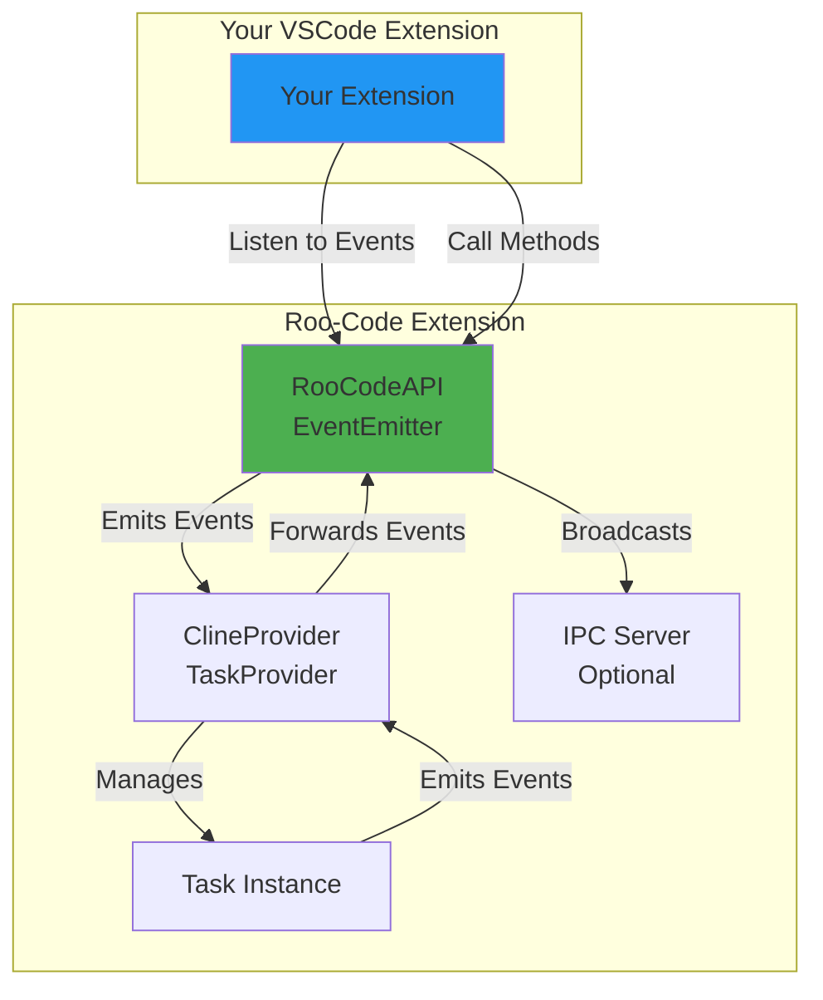

# Roo-Code Events Integration Guide

We want to 'tap' into the Roo Code's activitities so we can post that telemetry elsewhere. In addtion, we will want to create our own events/api/IPC that mirrors the ROO Code pattern.

Ours will be about a bridge between ROO and another agent that is _not_ a vscode extension.

So we need to create the vscode ext scaffolding. Lay the foundation to build out the extension.

So minimum viable product is proof that we can listen in on ROO and log what is happening and we can also expose and api by which we can control Roo.

Here is the research thus far:
## Overview

**Yes, what you want to do is absolutely possible!** Roo-Code exposes a comprehensive event system through its public API that allows external VSCode extensions to integrate and react to various task lifecycle events, execution events, and configuration changes.

## Architecture

Roo-Code uses a Node.js EventEmitter-based architecture with two main integration points:

1. **RooCodeAPI** - The main public API exposed by the extension
2. **IPC Server** - Optional Unix socket-based IPC for external process communication



## Events Emitted by Roo-Code

Roo-Code emits events through the [`RooCodeAPI`](../src/extension/api.ts:28) interface, which extends Node.js EventEmitter. All events are defined in [`RooCodeEventName`](../packages/types/src/events.ts:10) enum.

### Task Lifecycle Events

These events track the overall lifecycle of tasks:

| Event | Payload | Description |
|-------|---------|-------------|
| `taskCreated` | `[taskId: string]` | Emitted when a new task is created |
| `taskStarted` | `[taskId: string]` | Emitted when a task begins execution |
| `taskCompleted` | `[taskId: string, tokenUsage: TokenUsage, toolUsage: ToolUsage, { isSubtask: boolean }]` | Emitted when a task completes successfully |
| `taskAborted` | `[taskId: string]` | Emitted when a task is cancelled/aborted |
| `taskFocused` | `[taskId: string]` | Emitted when a task gains focus |
| `taskUnfocused` | `[taskId: string]` | Emitted when a task loses focus |
| `taskActive` | `[taskId: string]` | Emitted when a task becomes active (running) |
| `taskInteractive` | `[taskId: string]` | Emitted when a task is waiting for user input |
| `taskResumable` | `[taskId: string]` | Emitted when a task can be resumed |
| `taskIdle` | `[taskId: string]` | Emitted when a task becomes idle |

### Subtask Lifecycle Events

These events track parent-child task relationships:

| Event | Payload | Description |
|-------|---------|-------------|
| `taskPaused` | `[taskId: string]` | Emitted when a task is paused (e.g., spawning subtask) |
| `taskUnpaused` | `[taskId: string]` | Emitted when a task resumes after being paused |
| `taskSpawned` | `[parentTaskId: string, childTaskId: string]` | Emitted when a task spawns a child task |

### Task Execution Events

These events provide real-time updates during task execution:

| Event | Payload | Description |
|-------|---------|-------------|
| `message` | `[{ taskId: string, action: "created" \| "updated", message: ClineMessage }]` | Emitted for every message in the conversation (user, assistant, tool use, etc.) |
| `taskModeSwitched` | `[taskId: string, mode: string]` | Emitted when a task switches modes (e.g., code → architect) |
| `taskAskResponded` | `[taskId: string]` | Emitted when user responds to a task's question |
| `taskUserMessage` | `[taskId: string]` | Emitted when user sends a message to a task |

### Task Analytics Events

These events provide metrics and error tracking:

| Event | Payload | Description |
|-------|---------|-------------|
| `taskTokenUsageUpdated` | `[taskId: string, tokenUsage: TokenUsage]` | Emitted when token usage is updated |
| `taskToolFailed` | `[taskId: string, tool: ToolName, error: string]` | Emitted when a tool execution fails |

### Configuration Events

These events track configuration changes:

| Event | Payload | Description |
|-------|---------|-------------|
| `modeChanged` | `[mode: string]` | Emitted when the active mode changes |
| `providerProfileChanged` | `[{ name: string, provider?: string }]` | Emitted when the API provider profile changes |

## Events Roo-Code Listens To

Roo-Code **does not expose a public event listener interface** for external extensions to emit events that Roo-Code would consume. Instead, it provides **method-based APIs** for external control:

### Control Methods

From [`RooCodeAPI`](../packages/types/src/api.ts:11):

```typescript
interface RooCodeAPI {
  // Task Control
  startNewTask(options: { configuration?, text?, images?, newTab? }): Promise<string>
  resumeTask(taskId: string): Promise<void>
  clearCurrentTask(lastMessage?: string): Promise<void>
  cancelCurrentTask(): Promise<void>
  sendMessage(message?: string, images?: string[]): Promise<void>
  pressPrimaryButton(): Promise<void>
  pressSecondaryButton(): Promise<void>
  
  // Configuration Management
  getConfiguration(): RooCodeSettings
  setConfiguration(values: RooCodeSettings): Promise<void>
  
  // Profile Management
  getProfiles(): string[]
  createProfile(name: string, profile?: ProviderSettings, activate?: boolean): Promise<string>
  updateProfile(name: string, profile: ProviderSettings, activate?: boolean): Promise<string | undefined>
  deleteProfile(name: string): Promise<void>
  getActiveProfile(): string | undefined
  setActiveProfile(name: string): Promise<string | undefined>
  
  // State Queries
  isReady(): boolean
  getCurrentTaskStack(): string[]
  isTaskInHistory(taskId: string): Promise<boolean>
}
```

## Integration Patterns

### Pattern 1: Event Listener Extension

Create a VSCode extension that listens to Roo-Code events:

```typescript
import * as vscode from 'vscode';
import type { RooCodeAPI } from '@roo-code/types';

export function activate(context: vscode.ExtensionContext) {
  // Get Roo-Code API
  const rooCodeExt = vscode.extensions.getExtension('rooveterinaryinc.roo-code');
  
  if (!rooCodeExt) {
    vscode.window.showErrorMessage('Roo-Code extension not found');
    return;
  }
  
  // Wait for activation
  rooCodeExt.activate().then((api: RooCodeAPI) => {
    // Listen to task lifecycle events
    api.on('taskStarted', (taskId: string) => {
      console.log(`Task started: ${taskId}`);
      // Your custom logic here
    });
    
    api.on('taskCompleted', (taskId, tokenUsage, toolUsage, meta) => {
      console.log(`Task completed: ${taskId}`);
      console.log(`Tokens used: ${tokenUsage.totalTokens}`);
      console.log(`Is subtask: ${meta.isSubtask}`);
      // Your custom logic here
    });
    
    // Listen to execution events
    api.on('message', ({ taskId, action, message }) => {
      if (message.type === 'say' && message.say === 'api_req_started') {
        console.log(`API request started for task ${taskId}`);
      }
    });
    
    // Listen to analytics events
    api.on('taskToolFailed', (taskId, tool, error) => {
      console.log(`Tool ${tool} failed in task ${taskId}: ${error}`);
      // Send to your analytics service
    });
  });
}
```

### Pattern 2: Task Controller Extension

Create an extension that controls Roo-Code programmatically:

```typescript
import * as vscode from 'vscode';
import type { RooCodeAPI } from '@roo-code/types';

export function activate(context: vscode.ExtensionContext) {
  const rooCodeExt = vscode.extensions.getExtension('rooveterinaryinc.roo-code');
  
  rooCodeExt?.activate().then((api: RooCodeAPI) => {
    // Register a command to start a task
    const startTaskCmd = vscode.commands.registerCommand(
      'myext.startRooTask',
      async () => {
        const taskId = await api.startNewTask({
          text: 'Create a new React component',
          configuration: {
            mode: 'code',
            currentApiConfigName: 'my-profile'
          }
        });
        
        console.log(`Started task: ${taskId}`);
      }
    );
    
    // Register a command to monitor task progress
    const monitorCmd = vscode.commands.registerCommand(
      'myext.monitorTask',
      () => {
        api.on('taskTokenUsageUpdated', (taskId, usage) => {
          vscode.window.showInformationMessage(
            `Task ${taskId}: ${usage.totalTokens} tokens used`
          );
        });
      }
    );
    
    context.subscriptions.push(startTaskCmd, monitorCmd);
  });
}
```

### Pattern 3: IPC-Based Integration

For external processes (non-VSCode extensions), use the IPC server:

```typescript
import { IpcClient } from '@roo-code/ipc';

const client = new IpcClient('/path/to/socket');

client.on('taskEvent', (event) => {
  console.log('Received event:', event.eventName, event.payload);
});

// Send commands
client.send({
  type: 'taskCommand',
  origin: 'client',
  data: {
    commandName: 'startNewTask',
    data: {
      text: 'Create a new feature',
      configuration: { mode: 'code' }
    }
  }
});
```

## Key Implementation Details

### Event Flow

1. **Task Creation**: [`ClineProvider`](../src/core/webview/ClineProvider.ts:118) creates a task and emits `TaskCreated`
2. **Event Registration**: [`API.registerListeners()`](../src/extension/api.ts:204) sets up listeners on the task
3. **Event Forwarding**: Task events are forwarded through the provider to the API
4. **Broadcasting**: [`API.emit()`](../src/extension/api.ts:99) broadcasts to both EventEmitter listeners and IPC clients

### Event Sources

- **Provider Events**: Emitted by [`ClineProvider`](../src/core/webview/ClineProvider.ts:118) (implements [`TaskProviderLike`](../packages/types/src/task.ts:14))
- **Task Events**: Emitted by individual Task instances (implements [`TaskLike`](../packages/types/src/task.ts:112))
- **Cloud Bridge**: [`ExtensionChannel`](../packages/cloud/src/bridge/ExtensionChannel.ts:28) forwards events to cloud services

## Recommendations for Your Extension

### ✅ What You Can Do

1. **Listen to all task lifecycle events** - Track when tasks start, complete, or fail
2. **Monitor execution in real-time** - React to messages, tool uses, and mode switches
3. **Track analytics** - Collect token usage, tool failures, and performance metrics
4. **Control tasks programmatically** - Start, stop, resume tasks via API methods
5. **Manage configurations** - Create and switch between API profiles
6. **Build custom UIs** - Create dashboards showing task status and metrics
7. **Integrate with external services** - Send events to logging, analytics, or monitoring services

### ❌ What You Cannot Do

1. **Inject custom events into Roo-Code** - No public event listener interface for external events
2. **Modify task behavior mid-execution** - Limited to start/stop/resume controls
3. **Override internal event handlers** - Cannot intercept or modify event flow
4. **Access internal state directly** - Must use provided API methods

### 🎯 Recommended Use Cases

1. **Task Analytics Dashboard** - Visualize token usage, completion rates, tool usage
2. **Team Collaboration** - Share task status across team members
3. **CI/CD Integration** - Trigger Roo-Code tasks from build pipelines
4. **Custom Notifications** - Send alerts when tasks complete or fail
5. **Audit Logging** - Track all task activities for compliance
6. **Performance Monitoring** - Analyze task execution times and resource usage
7. **Custom Workflows** - Chain multiple Roo-Code tasks together

## Example: Complete Integration

Here's a complete example of a VSCode extension that integrates with Roo-Code:

```typescript
import * as vscode from 'vscode';
import type { RooCodeAPI, RooCodeEventName } from '@roo-code/types';

class RooCodeMonitor {
  private api: RooCodeAPI | null = null;
  private statusBar: vscode.StatusBarItem;
  private outputChannel: vscode.OutputChannel;
  
  constructor() {
    this.statusBar = vscode.window.createStatusBarItem(
      vscode.StatusBarAlignment.Right,
      100
    );
    this.outputChannel = vscode.window.createOutputChannel('Roo-Code Monitor');
  }
  
  async initialize() {
    const rooCodeExt = vscode.extensions.getExtension('rooveterinaryinc.roo-code');
    
    if (!rooCodeExt) {
      throw new Error('Roo-Code extension not found');
    }
    
    this.api = await rooCodeExt.activate();
    this.setupEventListeners();
    this.statusBar.text = '$(check) Roo-Code: Ready';
    this.statusBar.show();
  }
  
  private setupEventListeners() {
    if (!this.api) return;
    
    // Task lifecycle
    this.api.on('taskStarted', (taskId) => {
      this.statusBar.text = `$(sync~spin) Roo-Code: Running`;
      this.log(`Task started: ${taskId}`);
    });
    
    this.api.on('taskCompleted', (taskId, tokenUsage, toolUsage, meta) => {
      this.statusBar.text = `$(check) Roo-Code: Completed`;
      this.log(`Task completed: ${taskId}`);
      this.log(`Tokens: ${tokenUsage.totalTokens}`);
      this.log(`Tools used: ${Object.keys(toolUsage).join(', ')}`);
      
      vscode.window.showInformationMessage(
        `Task completed! Used ${tokenUsage.totalTokens} tokens`
      );
    });
    
    this.api.on('taskAborted', (taskId) => {
      this.statusBar.text = `$(x) Roo-Code: Aborted`;
      this.log(`Task aborted: ${taskId}`);
    });
    
    // Execution monitoring
    this.api.on('message', ({ taskId, action, message }) => {
      if (message.type === 'say') {
        this.log(`[${taskId}] ${message.say}: ${message.text || ''}`);
      }
    });
    
    // Analytics
    this.api.on('taskToolFailed', (taskId, tool, error) => {
      this.log(`Tool failed: ${tool} - ${error}`);
      vscode.window.showWarningMessage(`Tool ${tool} failed: ${error}`);
    });
  }
  
  private log(message: string) {
    const timestamp = new Date().toISOString();
    this.outputChannel.appendLine(`[${timestamp}] ${message}`);
  }
  
  dispose() {
    this.statusBar.dispose();
    this.outputChannel.dispose();
  }
}

export function activate(context: vscode.ExtensionContext) {
  const monitor = new RooCodeMonitor();
  
  monitor.initialize().catch(err => {
    vscode.window.showErrorMessage(`Failed to initialize Roo-Code monitor: ${err.message}`);
  });
  
  context.subscriptions.push(monitor);
}
```

## Next Steps

1. **Install Roo-Code types**: Add `@roo-code/types` to your extension's dependencies
2. **Create your extension**: Use the patterns above as a starting point
3. **Test event handling**: Start with simple event listeners before building complex logic
4. **Handle edge cases**: Account for Roo-Code not being installed or activated
5. **Document your integration**: Help users understand how your extension works with Roo-Code

## Additional Resources

- **API Implementation**: [`src/extension/api.ts`](../src/extension/api.ts:28)
- **Event Definitions**: [`packages/types/src/events.ts`](../packages/types/src/events.ts:10)
- **Task Types**: [`packages/types/src/task.ts`](../packages/types/src/task.ts:14)
- **IPC Implementation**: [`packages/ipc/src/ipc-client.ts`](../packages/ipc/src/ipc-client.ts)
- **Cloud Bridge Example**: [`packages/cloud/src/bridge/ExtensionChannel.ts`](../packages/cloud/src/bridge/ExtensionChannel.ts:28)